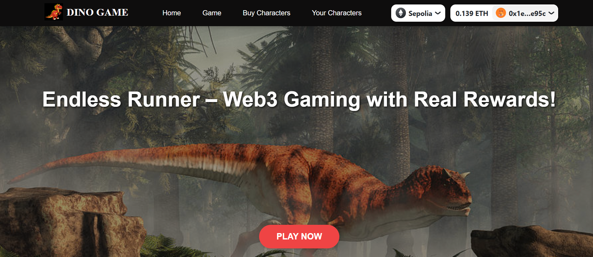

# Endless Runner - A Web3 Game
  Try it : https://endless-runner-game-web3-frontend.vercel.app/
## 🚀 Overview
Endless Runner is a Web3 game where players earn **Dino Tokens** 🦖 by playing. These tokens can be used to **buy new characters (NFTs)**, which are stored in the player's **MetaMask wallet**.



### 🎁 Rewards System
- **Score 500+** → Get a **free NFT character** 🎉
- **Score 1500+** → Get an **exclusive, more attractive character** 🔥

## 🛠️ Tech Stack
- **Frontend:** React, Wagmi, Viem
- **Backend:** Node.js
- **Smart Contracts:** Solidity, Hardhat, ERC1155

## 🌟 Why Endless Runner is Different?
✅ **Full Ownership** – Your NFTs are stored in **your** MetaMask, not controlled by developers.  
✅ **Trade & Share** – Sell, trade, or lend your NFTs to friends so they can use them in-game.  
✅ **Decentralized Assets** – Unlike traditional games, your purchases are truly **yours**.  

## 📜 Smart Contracts
- **Dino Token Contract:** `0x98ba2bbf253E507E4656b018faD50ceFa74Eb5BC`
- **NFT Marketplace Contract:** `0xEDD3CFAD07dB2F501fFf6a10D02D5a9a974a7319`

## 🔧 Installation & Setup
1. Clone the repository:
   ```sh
   git clone https://github.com/yourusername/endless-runner.git
   cd endless-runner
   ```

2. Install dependencies:
   ```sh
   npm install
   ```

3. Set up environment variables (`.env` file):
   ```env
   PRIVATE_KEY=your_private_key
   RPC_URL=your_rpc_url
   ```

4. Start the frontend:
   ```sh
   npm run dev
   ```

5. Start the backend:
   ```sh
   node index.js
   ```

## 🎮 How to Play
1. **Connect your wallet** using MetaMask.
2. **Start running** and earn Dino Tokens.
3. **Use Dino Tokens** to buy new characters (NFTs).
4. **Reach higher scores** to win exclusive NFTs!


